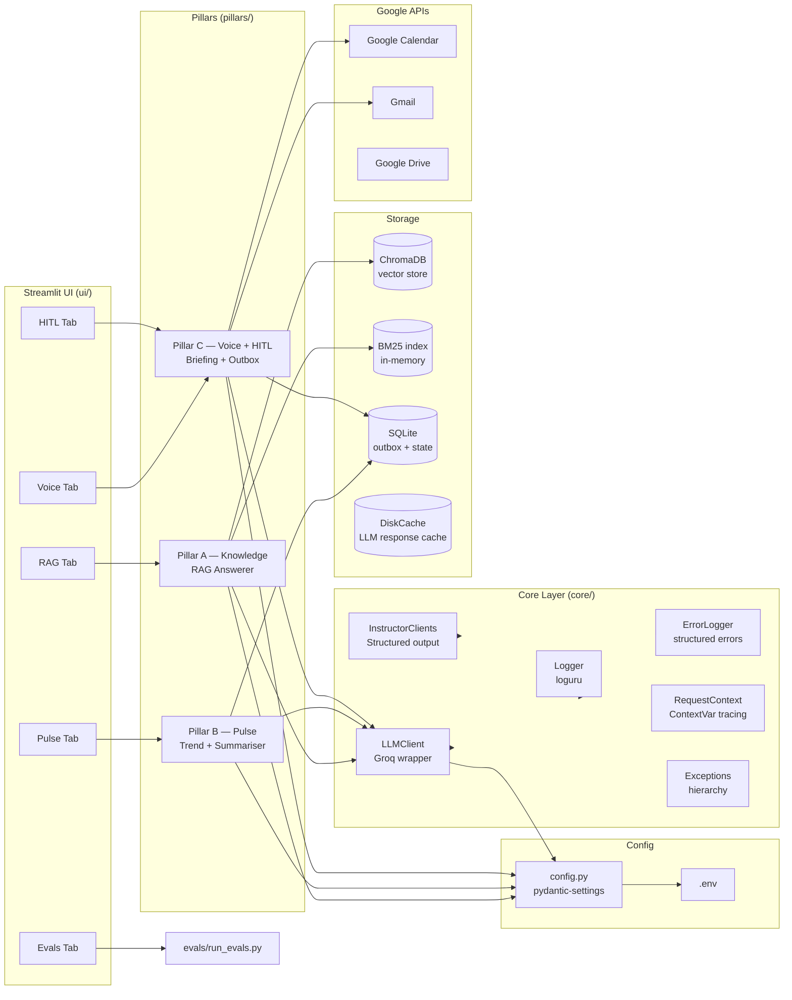

# Architecture

## System Diagram



---

## Data Flow

### Flow 1: KB Query → Cited Answer (Pillar A)
```
User query (text)
  → RequestContext: assign request_id
  → Router: classify as factsheet / fee / comparison
  → Hybrid Retrieval: BM25 candidates ∪ ChromaDB vector candidates (top-K each)
  → Cross-encoder reranker: score and sort, keep top-3
  → Answerer prompt: system guard (no investment advice) + chunks + query
  → LLMClient.chat() → Groq API → raw answer
  → Post-processor: enforce 6-bullet format, inject [source:X] tags
  → Return to UI
```

### Flow 2: Reviews CSV → Weekly Pulse (Pillar B)
```
CSV upload (300 rows, 2 weeks)
  → PII redaction: names → [REDACTED]
  → Text normalisation + deduplication
  → BM25 / embedding clustering → top-3 theme labels (LLM)
  → Trend detection: compare cluster sizes vs. prior 2-week window in SQLite
  → Pulse generator: ≤250 words, exactly 3 actions, trend arrows
  → Store pulse + metadata in SQLite
  → Return pulse to UI (< 60s total)
```

### Flow 3: Voice Briefing → HITL → Google APIs (Pillar C)
```
Advisor initiates call prep
  → Load customer segment + top themes from SQLite
  → Voice briefing generator: spoken opening with top theme
  → Post-call: Advisor triggers follow-up workflow
  → Gmail draft generator → store draft in SQLite outbox (status=PENDING)
  → Calendar hold generator → store hold in SQLite outbox (status=PENDING)
  → HITL UI: Advisor reviews both artifacts, edits if needed, clicks Approve
  → On approval: Gmail API create draft + Calendar API create event
  → Update outbox status=SENT / CREATED
  → Log to system_errors.log if any API call fails
```

---

## Component Map

| File / Directory | Responsibility | Phase Built |
|---|---|---|
| `config.py` | Typed settings, env loading, path constants | 0 |
| `core/exceptions.py` | Domain exception hierarchy | 0 |
| `core/request_context.py` | ContextVar request-ID tracing | 0 |
| `core/logger.py` | Loguru console + file + JSONL sinks | 0 |
| `core/error_logger.py` | Structured error log writer | 0 |
| `core/llm_client.py` | Groq wrapper with retry + circuit breaker | 0 |
| `core/instructor_clients.py` | Instructor-patched structured-output clients | 0 |
| `schemas/` | Pydantic schema contracts for all pillars | 1 |
| `pillars/pillar_a_knowledge/` | Hybrid retrieval + rerank + answerer | 2–4 |
| `pillars/pillar_b_voice/` | Pulse, trend detection, weekly summary | 5–6 |
| `pillars/pillar_c_hitl/` | Voice briefing, HITL outbox, Google API calls | 7 |
| `evals/` | Eval harness, golden dataset, judge | 8–9 |
| `ui/` | Streamlit tabs for all pillars | 3, 6, 7, 9 |
| `data/` | Factsheets, fees, ChromaDB, SQLite | 2+ |
| `logs/` | App logs, JSONL, structured error log | 0 |
| `docs/` | Design docs | 0.5 |

---

## Production Swap Paths (Documented, Not Built)

These are identified upgrade paths for when the project outgrows its solo-dev / free-tier constraints. None are implemented in the 9-day build.

### Streamlit monolith → FastAPI backend + frontend split
Extract all pillar logic into FastAPI route handlers. Replace Streamlit with a React or Next.js frontend. Retain the same core/ layer unchanged. Migration effort: ~3 days. Benefit: horizontal scaling, API versioning, proper auth middleware.

### SQLite outbox → Redis + Celery workers
Replace the SQLite PENDING/SENT outbox pattern with a Redis queue and Celery worker pool. Enables durable async execution, retries with backoff, and dead-letter queues for failed Google API calls. Migration effort: ~2 days. Benefit: fault-tolerant background processing.

### Single-hop RAG → Multi-hop query decomposition
Add a query decomposition layer before retrieval: complex questions are split into 2–3 sub-questions, each answered independently, then synthesised. Requires a planning LLM call and answer merger. Migration effort: ~1.5 days. Benefit: significantly higher faithfulness on multi-fund comparison queries.

### OAuth desktop flow → Streamlit st.login() OIDC
Replace the local `credentials.json` + browser-redirect OAuth flow with Streamlit's native OIDC login (`st.login()`), planned for Streamlit 1.x. Enables proper multi-user auth without managing token files. Migration effort: ~0.5 days once Streamlit ships the feature. Already planned for Phase 5 if available.

---

## Non-Goals (Explicit)

- **No multi-user authentication**: single user, single Streamlit session. No auth middleware, no session tokens, no user database.
- **No production scale**: designed for one analyst and one advisor running queries sequentially. No concurrency guarantees.
- **No real voice telephony**: voice call briefing is text-simulated. No Twilio, no WebRTC, no audio processing.
- **No continuous deployment pipeline**: no GitHub Actions CI, no Docker, no cloud deployment in scope. Stretch goal only for Day 8.
- **No billing or payment integration**: all API usage is on free tiers. No metering, no cost tracking.
